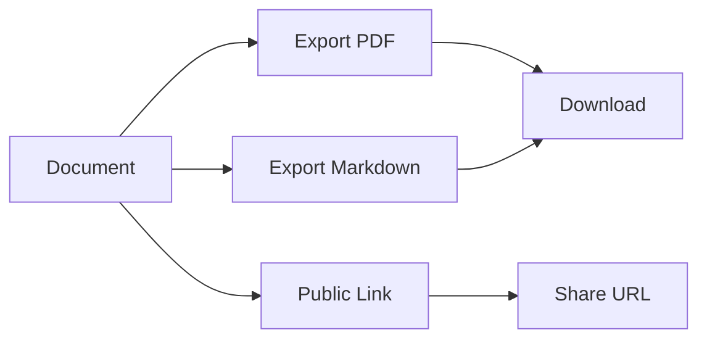

## Overview

Acaf-toulouse provides powerful tools to manage your documentation effectively. You organize content into intuitive hierarchies, collaborate seamlessly with teams, search efficiently, and share outputs in multiple formats. These features help you maintain up-to-date, accessible documentation without complexity.

<Columns cols={2}>
  <Card title="Organize Documents" icon="folder" href="#organization">
    Build nested structures for clear navigation.
  </Card>
  <Card title="Collaborate Securely" icon="users" href="#collaboration">
    Edit, review, and track changes together.
  </Card>
  <Card title="Search Smartly" icon="search" href="#search">
    Find content instantly with advanced filters.
  </Card>
  <Card title="Export Easily" icon="download" href="#export">
    Generate PDFs, Markdown, or HTML shares.
  </Card>
</Columns>

## Document Organization and Hierarchies

Create structured documentation spaces with folders, pages, and subpages. You nest content logically to reflect your project's architecture, making navigation intuitive.

<Steps>
  <Step title="Create a Space" icon="plus">
    Start a new documentation space for your project.

    ```
    POST https://api.example.com/v1/spaces
    ```

    Include `name` and `description` in the body.
  </Step>
  <Step title="Add Folders" icon="folder">
    Organize pages into folders.

````javascript
const newFolder = await fetch('https://api.example.com/v1/folders', {
  method: 'POST',
  body: JSON.stringify({
    spaceId: 'space-123',
    name: 'API Reference',
    parentId: null
  })
});
````

  </Step>
  <Step title="Nest Pages" icon="file-text">
    Add pages under folders for hierarchy.
  </Step>
</Steps>

<Callout kind="tip">
Use consistent naming conventions like "API v1.0" for folders to speed up team onboarding.
</Callout>

## Collaboration and Version Control

Team members edit documents in real-time with granular permissions. Track every change with version history, rollbacks, and diff views.

<Tabs>
  <Tab title="Real-time Editing" icon="edit-3">
    Multiple users modify content simultaneously. Changes appear instantly without page reloads.
  </Tab>
  <Tab title="Version History" icon="git-branch">
    View and restore previous versions.

    <CodeGroup tabs="JavaScript,cURL">
````javascript
// Fetch version history
const history = await fetch('https://api.example.com/v1/documents/space-123/history');
const versions = await history.json();
````
````bash
curl -H "Authorization: Bearer YOUR_TOKEN" \
  https://api.example.com/v1/documents/space-123/history
````
    </CodeGroup>
  </Tab>
</Tabs>

## Search and Filtering Tools

Locate any document quickly with full-text search, tags, and filters. Support advanced queries for titles, content, or metadata.

| Filter Type | Description | Example Query |
|-------------|-------------|---------------|
| Full-text   | Searches across all content | `authentication API` |
| Tags        | Filters by user-defined tags | `tag:security` |
| Date Range  | Recent changes only | `created:>2024-01-01` |
| Author      | Content by specific user | `author:john@example.com` |

<Callout kind="info">
Combine filters like `tag:api created:>2024-01-01` for precise results.
</Callout>

<Expandable title="Advanced Search Syntax" default-open="false">
Use operators such as `AND`, `OR`, and `NOT` for complex queries. For example: `API AND (auth OR login) NOT deprecated`.
</Expandable>

## Export and Sharing Options

Share your documentation externally via exports or public links. Generate clean PDFs, Markdown files, or hosted pages.



<CodeGroup tabs="Node.js,Python">
````javascript
// Export to PDF
const pdf = await fetch('https://api.example.com/v1/documents/space-123/export/pdf', {
  headers: { Authorization: `Bearer ${YOUR_TOKEN}` }
});
````
````python
import requests
response = requests.get(
    'https://api.example.com/v1/documents/space-123/export/pdf',
    headers={'Authorization': f'Bearer {YOUR_TOKEN}'}
)
with open('docs.pdf', 'wb') as f:
    f.write(response.content)
````
</CodeGroup>

These core features form the foundation of Acaf-toulouse. Customize spaces to fit your workflow and scale with your team.